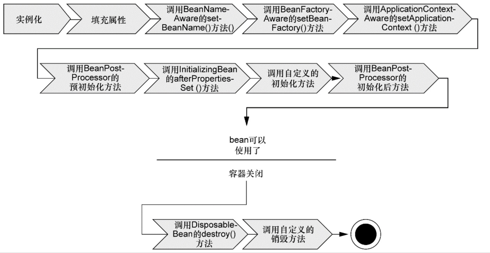
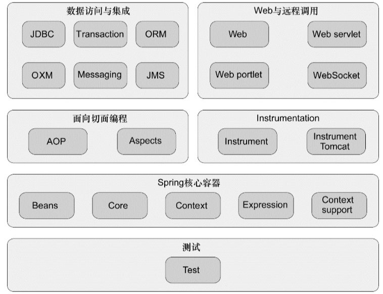

# 依赖注入与容器

> 总结依赖注入的设计思路、Spring实现依赖注入的机制（多种自动装配方式、多种依赖注入方式）。

##依赖注入

​    在传统的代码管理中，每个类负责各自所需要的依赖对象的创建。在一个项目中，会存在很多类，这样，过多的依赖会导致代码的高耦合，对测试、业务实现带来不便。

​    依赖注入：对象之间的依赖关系由系统中的某一特定组件在创建对象的时候负责设定。对象无需自行创建和管理它们的依赖关系。（即功能的调用者不需要考虑如何创建功能，在需要使用功能的时候可以直接使用）

​    在Spring中，对象之间的依赖关系设定在XML文件中，Spring通过读取XML配置文件，来自动注入对象的依赖关系。

1. 注入方式-（有两种）
   1. 构造器注入
   2. Getter、Setter注入
2. Spring自动装配
   1. 基于XML的Bean声明的自动装配---需要依赖两种注入方式
   2. 基于Java配置的自动装配----需要依赖两种注入方式
   3. 基于注解的自动装配----需要依赖两种注入方式
3. ApplicationContext应用上下文负责加载XML文件，执行装配流程。（Spring应用上下文全权负责对象的创建和依赖组装）

##Spring容器及Spring模块

> 总结Spring容器、Spring框架几大模块的特点。

1. 容器是Spring的核心。Spring容器负责对象的配置、创建和装配，负责管理对象的生命周期。

2. Spring容器可以划分为两种类型

   1. 基于BeanFactory的Bean工厂，是最简单的Spring容器。
   2. 基于BeanFactory的实现ApplicationContext，是框架级的Spring容器。

3. ApplicationContext上下文的几种常见实践

   1. AnnotationConfigApplicationContext：从一个或多个基于Java的配置类中加载上下文。
   2. AnnotationConfigWebApplicationContext：从一个或多个基于Java的配置类中加载Web上下文。
   3. ClassPathXmlApplicationContext：从类路径下的一个或多个基于XML的配置文件中加载上下文。
   4. FileSystemXmlApplicationContext：从文件系统下的一个或多个基于XML的配置文件中加载上下文。
   5. XmlWebApplicationContext：从Web应用下的一个或多个基于XML的配置文件中加载上下文。

4. Spring Bean的生命周期

   

5. Spring框架包含几个模块

   

   1. Spring容器（Bean、Context、Core、Expression）：容器是Spring的核心部分，管理着Bean的创建、配置和管理。
   2. Spring AOP
   3. 数据访问和集成（JDBC、ORM、JMS等）：JDBC、DAO等抽象了大量的样板式代码，此外还提供了ORM模块，ORM模块建立在对DAO的支持上，通过ORM，可以方便的构建DAO。Spring没有提供ORM的解决方案，而是对许多第三方的ORM进行了集成。
   4. Web与远程调用：Spring提供了MVC框架，集成了远程调用RMI，并自己实现了一个远程调用框架：HTTP Invoker。
   5. Instrumentation：提供了为JVM添加代理的功能。